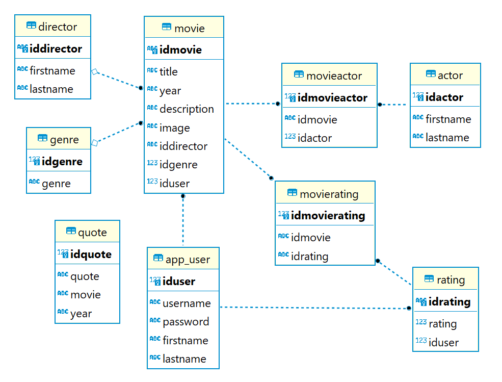

# myMovies

This is an independent project work of Developer Bootcamp 2022 organized by Saranen Consulting. The application is a movie themed single page app with all CRUD methods and stack is PostgreSQL, ASP.NET Core, React. The database and webapi are deployed on Heroku cloud service and frontend on Azure. The app can be run by clicking [here](https://mymoviesapplication.azurewebsites.net/).

If you don't want to create a new account, feel free to use these credentials :
username = username, password = password.

There are not many movies in the database,
so when searching, it is recommended to just type e.g. letter A.

## ER model

</img>